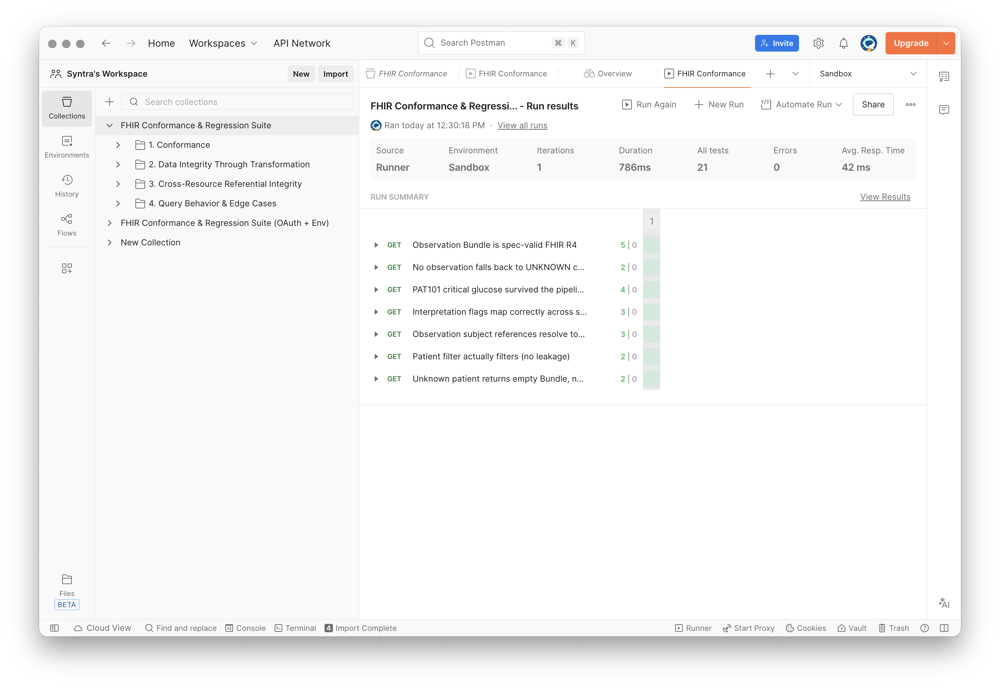
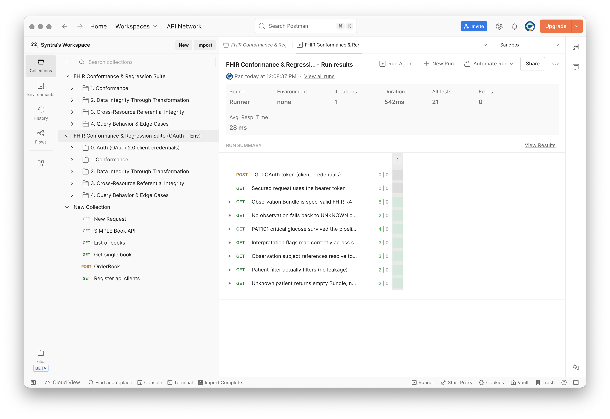
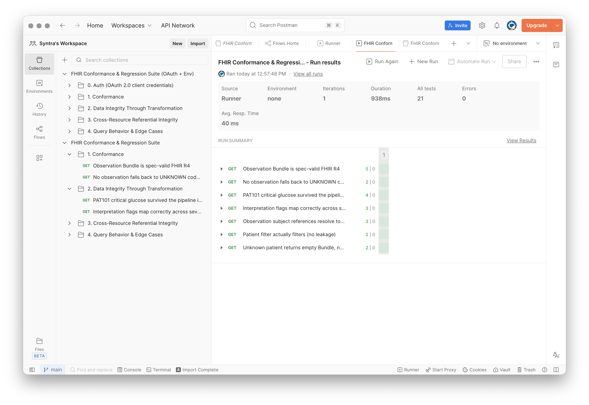

# API & Postman Healthcare Integration

End-to-end healthcare integration system built with BridgeLink (Mirth Connect), demonstrating HL7 v2.5 message processing, FHIR R4 API exposure, multi-database routing, mid-flight data enrichment, cross-channel data flow, and automated FHIR conformance testing via Postman.

## Architecture

```
┌─────────────────┐         ┌──────────────────────────────────────────────────────┐
│  Lab System      │         │                  BridgeLink                          │
│  (HL7 ORU^R01)   │────────▶│  ORU_Routing Channel (port 8081)                    │
└─────────────────┘         │    ├─ Parse PID, OBR, OBX segments                   │
                            │    ├─ Provider NPI lookup (OBR-16 → providers table)  │
                            │    ├─ Patient status lookup (→ patients table)        │
                            │    ├─▶ Critical file writer (HH, LL flags)           │
                            │    ├─▶ Normal file writer (N flag)                   │
                            │    ├─▶ Database Writer → bridgelink_db.lab_results   │
                            │    └─▶ Database Writer → mirthdb.lab_results         │
                            │         (filtered: abnormal only — HH/LL/H/L)        │
                            │                                                      │
┌─────────────────┐         │  ADT_Processing Channel (port 8083)                  │
│  Hospital ADT    │────────▶│    ├─ Parse event type (A01/A03/A08)                │
│  (HL7 ADT)       │         │    ├─ Extract PID/EVN/PV1 fields                    │
└─────────────────┘         │    ├─ UPSERT to patients table                      │
                            │    └─ Handles admit, discharge, update               │
                            │                                                      │
                            │  FHIR_API Channel (port 8082)                        │
┌─────────────────┐         │    ├─ Reads from mirthdb.lab_results                 │
│  Modern App /    │◀───────│    ├─ Returns FHIR R4 Observation Bundle             │
│  Postman Suite   │         │    └─ LOINC coded with interpretation flags          │
│  (REST/JSON)     │         │                                                      │
│                  │◀───────│  FHIR_Patient_API Channel (port 8084)                │
└─────────────────┘         │    ├─ Reads from bridgelink_db.patients              │
                            │    └─ Returns FHIR R4 Patient Bundle                 │
                            └──────────────────────────────────────────────────────┘

                            ┌──────────────────────────────────────────────────────┐
                            │                   PostgreSQL                         │
                            │                                                      │
                            │  bridgelink_db          mirthdb                      │
                            │  ├─ lab_results         ├─ lab_results (abnormal)    │
                            │  ├─ patients            └──────────────              │
                            │  └─ providers (reference)                            │
                            └──────────────────────────────────────────────────────┘
```

## Postman Test Suites

Two automated test collections validate the FHIR API output end-to-end — 21 tests each, all passing.

### FHIR Conformance & Regression Suite

The base collection runs against the local BridgeLink sandbox with no authentication. Tests are organized into four folders:

| Folder | What It Tests |
|--------|---------------|
| **1. Conformance** | FHIR R4 structural validity — Bundle type, required fields, coding system URIs, LOINC terminology coverage (catches `UNKNOWN` code fallback) |
| **2. Data Integrity Through Transformation** | Known HL7 input (PAT101 glucose 468 mg/dL, flag HH, LOINC 2345-7) survives the full HL7 → DB → FHIR pipeline with value, unit, code, and interpretation intact |
| **3. Cross-Resource Referential Integrity** | Observation `subject` references resolve to real Patient resources — no orphans |
| **4. Query Behavior & Edge Cases** | Patient filter prevents data leakage; unknown patient returns empty Bundle (200), not an error |

### FHIR Conformance & Regression Suite (OAuth + Env)

Same test coverage plus an OAuth 2.0 client-credentials folder that acquires a bearer token and caches it for reuse. Skips gracefully when no `tokenUrl` is configured (e.g. the open local sandbox).

### Environment Configs

- **Sandbox** — `localhost:8082` (Observations) / `localhost:8084` (Patients), no auth required
- **Production** — templated for a secured FHIR endpoint with OAuth credentials (placeholder values)

### Test Results

All three runs: **21/21 tests passing, 0 errors.**

| Run | Environment | Duration |
|-----|-------------|----------|
| OAuth suite | Sandbox | 542ms |
| Base suite | Sandbox | 786ms |
| OAuth suite | None | 938ms |







Runnable headless via [Newman](https://github.com/postmanlabs/newman) for CI regression:

```bash
newman run postman/collections/FHIR-Conformance-Suite.postman_collection.json \
  -e postman/environments/Sandbox.postman_environment.json
```

## What This Demonstrates

**HL7 v2.5 Processing**
- ORU^R01 (lab results) and ADT^A01/A03/A08 (patient movement) message parsing
- Segment extraction: MSH, PID, PV1, OBR, OBX, EVN
- ACK (MSH+MSA) response generation for every inbound message
- Error handling with try-catch on all field reads — malformed messages don't crash channels

**FHIR R4 API Layer**
- Observation resources with LOINC coding (2345-7 Glucose, 2823-3 Potassium, 6690-2 WBC, 718-7 Hemoglobin, 2160-0 Creatinine)
- Patient resources with proper name structure (family/given), gender mapping, and admission status
- FHIR Bundle responses with searchset type
- Unit coding via http://unitsofmeasure.org
- Interpretation codes via HL7 ObservationInterpretation CodeSystem

**Integration Patterns**
- Conditional routing: critical vs normal lab results to separate destinations
- Multi-destination output: one inbound message writes to files and two databases
- Mid-flight enrichment: NPI lookup from OBR-16 against provider reference table
- Cross-channel data flow: ORU channel reads patient admission status from ADT channel's database
- UPSERT logic: duplicate ADT messages update existing rows instead of failing
- Date casting: HL7 date strings (YYYYMMDD) to PostgreSQL DATE/TIMESTAMP types

**API Testing & Quality Assurance**
- FHIR R4 conformance validation (structural + semantic)
- Data integrity assertions through the full transformation pipeline
- Cross-resource referential integrity checks
- Negative-path and boundary testing
- OAuth 2.0 client-credentials flow with token reuse pattern
- Environment-driven configuration (sandbox vs production) with masked credentials
- CI-ready via Newman

## Tech Stack

- **Integration Engine**: BridgeLink 4.6.1 (Mirth Connect fork by Innovar Healthcare)
- **Database**: PostgreSQL 14+ (two databases: bridgelink_db, mirthdb)
- **Standards**: HL7 v2.5, FHIR R4, LOINC, HL7 FHIR terminology
- **Language**: JavaScript (BridgeLink transformers and JavaScript Writers)
- **API Testing**: Postman (collections + environments), Newman (CI runner)
- **Testing**: curl, psql, Postman Runner

## Project Structure

```
API-Postman-Healthcare-Integration/
├── README.md
├── channels/
│   ├── ORU_Routing.xml
│   ├── ADT_Processing.xml
│   ├── FHIR_API.xml
│   └── FHIR_Patient_API.xml
├── database/
│   ├── schema.sql
│   └── seed-data.sql
├── postman/
│   ├── collections/
│   │   ├── FHIR-Conformance-Suite.postman_collection.json
│   │   └── FHIR-Conformance-Suite-OAuth.postman_collection.json
│   ├── environments/
│   │   ├── Sandbox.postman_environment.json
│   │   └── Production.postman_environment.json
│   └── globals/
│       └── workspace.postman_globals.json
├── test-messages/
│   ├── oru/
│   │   ├── glucose-critical.hl7
│   │   ├── glucose-normal.hl7
│   │   ├── potassium-critical.hl7
│   │   ├── wbc-normal.hl7
│   │   ├── hemoglobin-critical.hl7
│   │   ├── creatinine-normal.hl7
│   │   └── missing-obx.hl7
│   └── adt/
│       ├── admit-a01.hl7
│       ├── admit-pat102.hl7
│       ├── admit-pat103.hl7
│       ├── discharge-a03.hl7
│       ├── update-a08.hl7
│       └── duplicate-admit.hl7
├── fhir-examples/
│   ├── observation-response.json
│   └── patient-response.json
└── docs/
    ├── setup-guide.md
    ├── testing-guide.md
    └── screenshots/
        ├── postman-base-suite-sandbox-run.png
        ├── postman-oauth-suite-sandbox-run.png
        └── postman-oauth-suite-no-env-run.png
```

## Quick Start

1. Install BridgeLink 4.6.1 and PostgreSQL
2. Run database setup: `psql -f database/schema.sql` against both databases
3. Seed provider data: `psql -d bridgelink_db -f database/seed-data.sql`
4. Import all four channel XML files into BridgeLink
5. Update JDBC connection strings — replace `${DB_HOST}`, `${DB_PORT}`, `${DB_USERNAME}`, `${DB_PASSWORD}` with your PostgreSQL credentials
6. Deploy channels
7. See [Setup Guide](docs/setup-guide.md) for detailed instructions

## Testing

See [Testing Guide](docs/testing-guide.md) for complete test scenarios including:
- Critical and normal lab result routing
- Patient admit/discharge/update lifecycle
- Cross-channel enrichment verification
- FHIR API response validation
- Error handling with malformed messages

### Postman Testing

1. Import collections from `postman/collections/` into Postman
2. Import the Sandbox environment from `postman/environments/`
3. Select the Sandbox environment and run either collection via the Runner
4. For CI: `newman run postman/collections/FHIR-Conformance-Suite.postman_collection.json -e postman/environments/Sandbox.postman_environment.json`

## Key Design Decisions

**Why two databases?** Demonstrates multi-destination routing — a single HL7 message writing to multiple data stores simultaneously, which is common in production where different systems consume the same data. The mirthdb store only receives abnormal results (HH/LL/H/L) via a destination filter, simulating a clinical alerting pipeline.

**Why UPSERT for ADT?** Hospital systems frequently resend messages (interface restarts, message replays). Without UPSERT, duplicate admits would crash the integration. ON CONFLICT DO UPDATE makes the system resilient to duplicates.

**Why mid-flight enrichment?** Lab systems send NPI numbers, not provider names. The receiving system needs human-readable data. Looking up the provider during transformation is how production integrations add context to raw messages.

**Why cross-channel lookup?** Lab results in isolation lack clinical context. Knowing whether a patient is currently admitted when their lab result arrives enables clinical decision support — a critical glucose on an admitted ICU patient is handled differently than one from an outpatient visit.

**Why LOINC codes?** FHIR Observations without standardized terminology coding are not interoperable. LOINC is the universal standard for lab test identification. Including proper coding demonstrates awareness of real-world FHIR compliance requirements.

**Why Postman conformance testing?** Returning 200 OK isn't enough — the FHIR output must be structurally valid R4, use real LOINC codes (not fallback `UNKNOWN`), and preserve clinical data through the transformation pipeline. The test suite caught a real mapping bug where the LOINC lookup keyed on full display names but the database stored abbreviations.

## Known Issues (Portfolio Findings)

- **SQL injection**: FHIR_API and ORU JDBC transformers concatenate `patient_id` directly into SQL queries. Production fix: parameterized queries.
- These are documented intentionally as security findings to demonstrate awareness of injection vulnerabilities in integration code.
